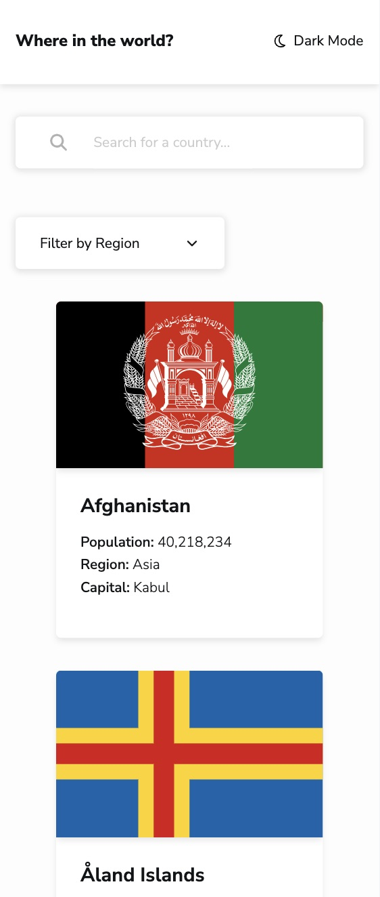
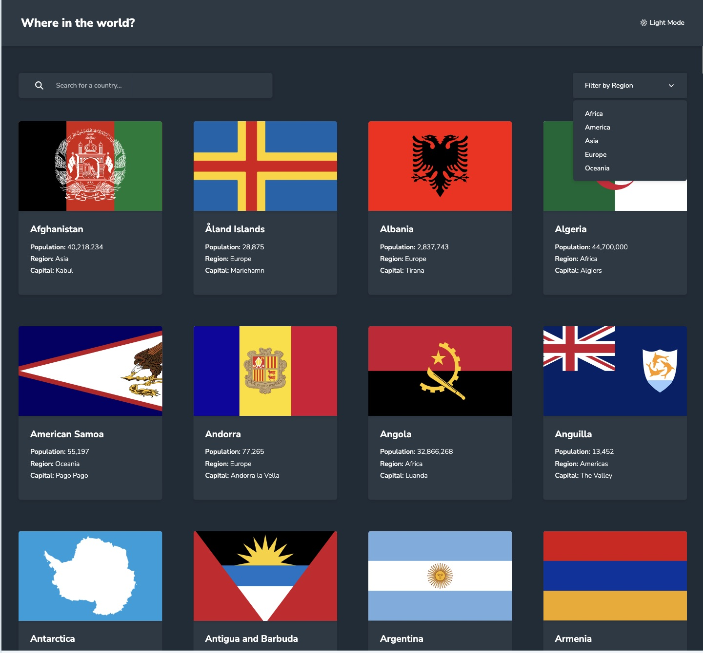
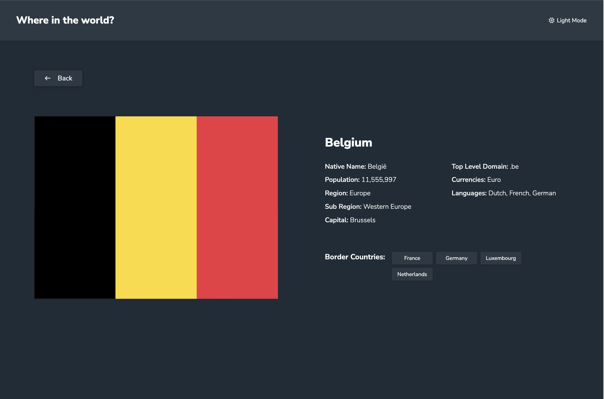

# Frontend Mentor - REST Countries API with color theme switcher solution

This is a solution to the [REST Countries API with color theme switcher challenge on Frontend Mentor](https://www.frontendmentor.io/challenges/rest-countries-api-with-color-theme-switcher-5cacc469fec04111f7b848ca). Frontend Mentor challenges help you improve your coding skills by building realistic projects. 

## Table of contents

- [Overview](#overview)
  - [The challenge](#the-challenge)
  - [Screenshot](#screenshot)
  - [Links](#links)
- [My process](#my-process)
  - [Built with](#built-with)
  - [What I learned](#what-i-learned)
  - [Continued development](#continued-development)

## Overview

### The challenge

Users should be able to:

- See all countries from the API on the homepage
- Search for a country using an `input` field
- Filter countries by region
- Click on a country to see more detailed information on a separate page
- Click through to the border countries on the detail page
- Toggle the color scheme between light and dark mode *(optional)*

### Screenshot






### Links

- Solution URL: [Add solution URL here](https://your-solution-url.com)
- Live Site URL: [Add live site URL here](https://your-live-site-url.com)

## My process

### Built with

- Semantic HTML5 markup
- CSS custom properties
- Flexbox
- CSS Grid
- Mobile-first workflow
- [React](https://reactjs.org/) - JS library

### What I learned

This project has two main pages, and I used props to pass data between them. When a country has bordering countries, they need to be displayed upon clicking, which I achieved by utilizing the same state. This approach was new to me.

To see how you can add code snippets, see below:

```jsx
const List = ({ data }) => {
  const [selectedCountry, setSelectedCountry] = useState(null);
  ...
  return (
    ...
    <h4 className='border-countries-title'>Border Countries:</h4>
    <ul className='border-countries-lists'>
        {(borderCountries ?? []).map(country => (
          <li 
            key={country.numericCode}
            className={`border-countries-list ${theme === 'light' ? 'light' : 'dark'}-border-countries-list`}
            onClick={() => {
              setSelectedCountry(country)
            }}
          >
            {country.name}
          </li>
        ))}
    </ul>
    ...
```

### Continued development

Since the current API doesn't provide the required data, I used local JSON data instead. Moving forward, I'll continue learning more about how to effectively fetch and manage data from APIs.
# rest-countries-api-with-color-theme-switcher-master
